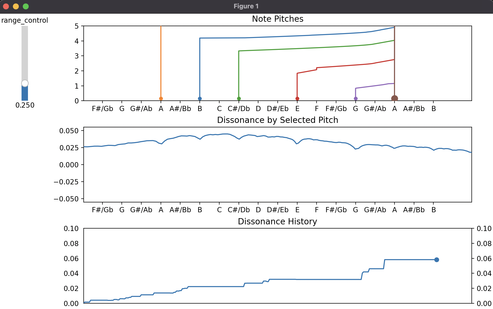

# Tone and Harmony Visualizer

## Description

Tone Graph Visualizer is a Python application designed to create interactive Matplotlib visualizations focusing on musical tones, their pitches, and the dissonance they create. The application generates three distinct graphs to illustrate the relationship and interplay between different tones.

## Getting Started

### Dependencies

* Ensure you have Python installed on your system.
* The application requires Matplotlib and other dependencies, which can be installed using the `requirements.txt` file included in the project.

### Installing

* Clone or download this repository to your local machine.
* Install the required packages using the following command:
  ```bash
  pip install -r requirements.txt
  ```

### Executing Program


* Run the main file using the following command:
  ```bash
  python tone_graph.py
  ```

<!--  -->


* Upon execution, three graphs will appear:
  1. **Top Graph**: Shows the pitch and pitch history of each active tone.
  2. **Middle Graph**: Displays how the overall dissonance changes with the movement of the selected tone.
  3. **Bottom Graph**: Illustrates the dissonance over time.

## Interacting with the Application

* **Select and Manipulate Tones**:
  - The larger dot represents the selected tone, which can be manipulated by the user.
  - Change the selected tone by pressing the left arrow key.
* **Modify Pitch**:
  - Press 'U' to increase the pitch of the selected tone.
  - Press 'Shift+U' to decrease the pitch of the selected tone.
* **Tone Management**:
  - Press 'A' to add a tone with a frequency of 440 Hz.
  - Press 'M' to shift the displayed tones towards resolution.
  - Press 'N' to maximize dissonance.
* **Fine-Tuning**:
  - Press 'R' to micro-adjust the selected tone to minimize dissonance.
  - Press 'Shift+R' for the same adjustment but for all tones above the base.
  - Press 'I' or 'Shift+I' to snap the selected or all tones to the nearest x-axis tick, respectively.
* **Exit Application**:
  - Press 'Q' to exit the application.

## Authors

Adam Zukerman
